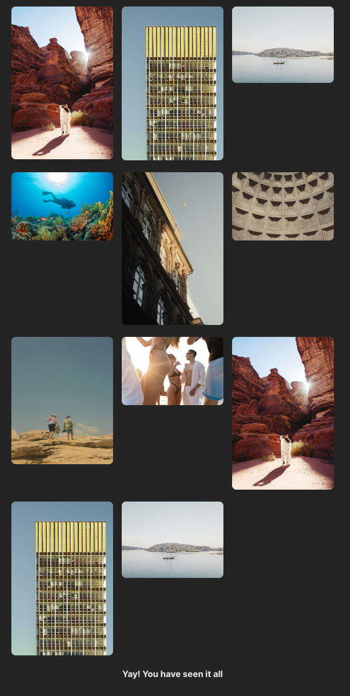

# React Image Gallery with Infinite Scroll

This project showcases a web application built with React, TypeScript, and Vite. It features an infinite scroll functionality that dynamically fetches and displays images from an API, providing users with a seamless browsing experience. Designed for performance and scalability, this application leverages modern web technologies and development best practices.



## Features

- **Infinite Scrolling**: Images are loaded dynamically as the user scrolls, improving engagement and user experience.
- **API Integration**: Fetches images from a specified API, demonstrating efficient asynchronous data handling.
- **Responsive Design**: The UI is fully responsive, ensuring compatibility with various devices and screen sizes.
- **TypeScript**: Utilizes TypeScript for type safety and developer productivity.
- **Vite**: Employs Vite for fast development and optimized production builds.
- **ESLint**: Integrates ESLint to enforce code quality and consistency.

## Getting Started

These instructions will get you a copy of the project up and running on your local machine for development and testing purposes.

### Prerequisites

Ensure you have the following installed:
- Node.js (latest stable version recommended)
- npm or Yarn

### Installation

1. Clone the repository:

2. Navigate to the project directory:
```bash
cd react-image-gallery-infinite-scroll
```

3. Start the development server:
```bash
npm run dev
```

## Technologies Used
* React
* TypeScript
* Vite
